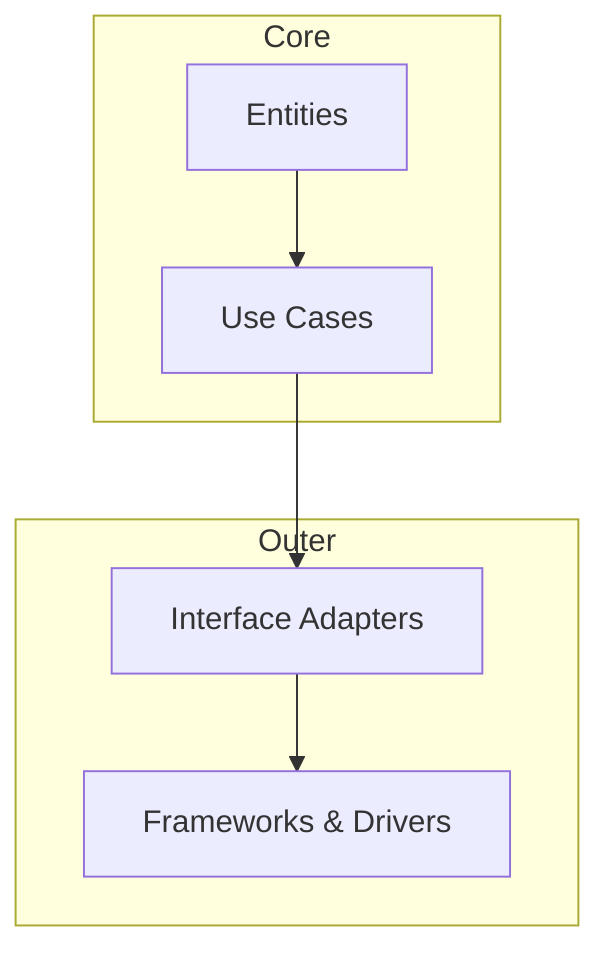
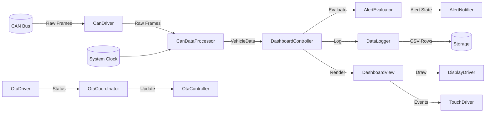
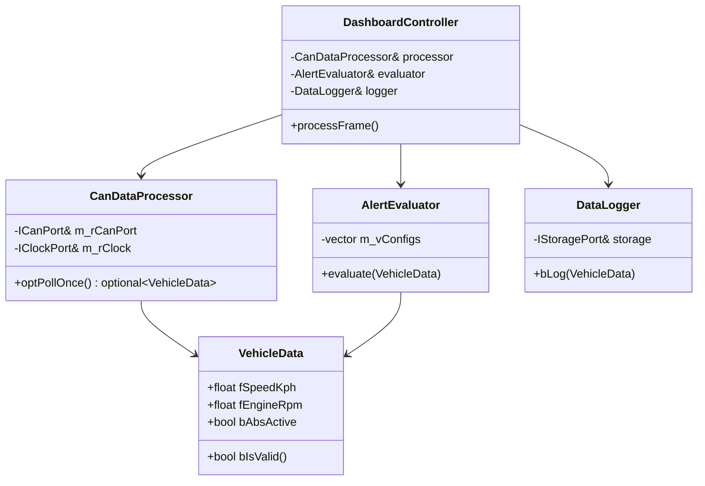
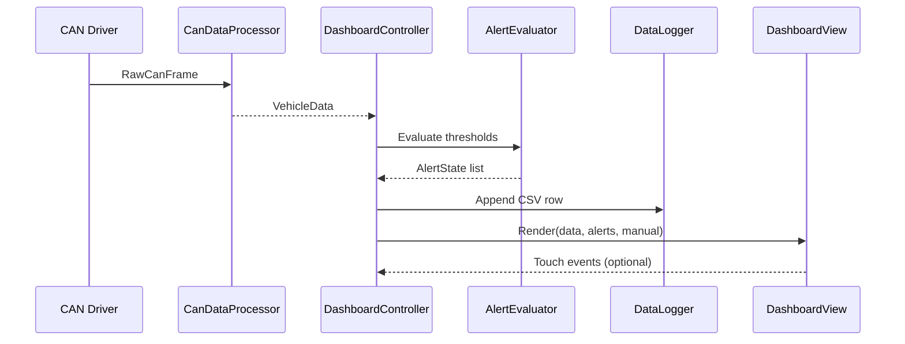
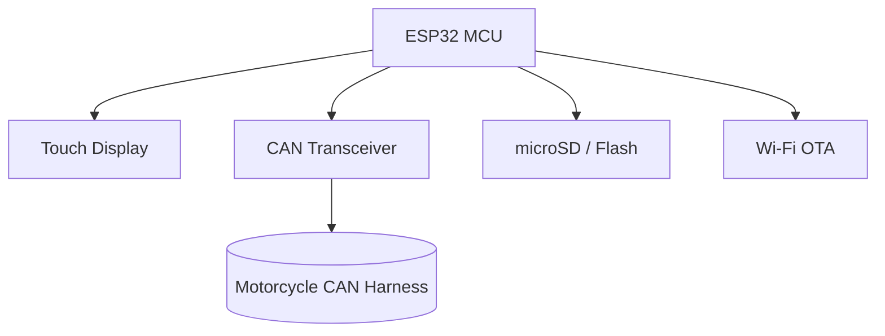

# Architecture Diagrams

## Clean Architecture Layers

```mermaid
graph TD
    A[Entities] --> B[Use Cases]
    B --> C[Interface Adapters]
    C --> D[Frameworks & Drivers]
    subgraph Core
        A
        B
    end
    subgraph Outer
        C
        D
    end
```

## Component Overview

```mermaid
graph LR
    CanBus[(CAN Bus)] -->|Raw Frames| CanDriver
    CanDriver -->|Raw Frames| CanDataProcessor
    Clock[(System Clock)] --> CanDataProcessor
    CanDataProcessor -->|VehicleData| DashboardController
    DashboardController -->|Evaluate| AlertEvaluator
    AlertEvaluator -->|Alert State| AlertNotifier
    DashboardController -->|Log| DataLogger
    DataLogger -->|CSV Rows| StorageDriver[(Storage)]
    DashboardController -->|Render| DashboardView
    DashboardView -->|Draw| DisplayDriver
    DashboardView -->|Events| TouchDriver
    OtaDriver -->|Status| OtaCoordinator
    OtaCoordinator -->|Update| OtaController
```

## Class Relationships

```mermaid
classDiagram
    class VehicleData {
        +float fSpeedKph
        +float fEngineRpm
        +bool bAbsActive
        +bool bIsValid()
    }
    class CanDataProcessor {
        -ICanPort& m_rCanPort
        -IClockPort& m_rClock
        +optPollOnce() optional~VehicleData~
    }
    class AlertEvaluator {
        -vector<AlertConfig> m_vConfigs
        +evaluate(VehicleData)
    }
    class DashboardController {
        -CanDataProcessor& processor
        -AlertEvaluator& evaluator
        -DataLogger& logger
        +processFrame()
    }
    class DataLogger {
        -IStoragePort& storage
        +bLog(VehicleData)
    }
    CanDataProcessor --> VehicleData
    DashboardController --> CanDataProcessor
    DashboardController --> AlertEvaluator
    DashboardController --> DataLogger
    AlertEvaluator --> VehicleData
```

## Data Flow Sequence

```mermaid
sequenceDiagram
    participant CAN as CAN Driver
    participant PROC as CanDataProcessor
    participant CTRL as DashboardController
    participant ALERT as AlertEvaluator
    participant LOG as DataLogger
    participant VIEW as DashboardView

    CAN->>PROC: RawCanFrame
    PROC-->>CTRL: VehicleData
    CTRL->>ALERT: Evaluate thresholds
    ALERT-->>CTRL: AlertState list
    CTRL->>LOG: Append CSV row
    CTRL->>VIEW: Render(data, alerts, manual)
    VIEW-->>CTRL: Touch events (optional)
```

## Hardware Topology

```mermaid
graph TD
    MCU[ESP32 MCU]
    Display[Touch Display]
    CANTransceiver[CAN Transceiver]
    Storage[microSD / Flash]
    WiFi[Wi-Fi OTA]

    MCU --> Display
    MCU --> CANTransceiver
    MCU --> Storage
    MCU --> WiFi
    CANTransceiver --> MotorcycleCAN[(Motorcycle CAN Harness)]
```
